# Presentation

TypeScript is an open-source programming language and is designed for development of large applications and transcompiles to JavaScript.

As TypeScript is a superset of JavaScript, existing JavaScript programs are also valid TypeScript programs.

TypeScript may be used to develop JavaScript applications for both client-side and server-side execution (as with Node.js)

TypeScript was developed by Anders Hejlsberg, who created Turbo Pascal, Delphi, and C #.

## Versions
TypeScript was first made public in October 2012 (at version 0.8), after two years of internal development at Microsoft.

TypeScript 0.9, released in 2013, added support for generics.

TypeScript 1.0 was released at Microsoft's Build developer conference in 2014. The development team announced a new TypeScript compiler, claiming 5× performance gains

On 22 September 2016, TypeScript 2.0 was released; it introduced several features, including the ability for programmers to optionally prevent variables from being assigned null values

The latest version today is 3.9

## Basic Types
1.	Boolean
2.	Number
3.	String
4.	Array
5.	Tuple
6.	Enum
7.	Any
8.	Void
9.	Null and Undefined
10.	Never

## Boolean
The most basic datatype is the simple true/false value, which JavaScript and TypeScript call a boolean value.
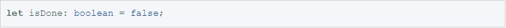

## Number
As in JavaScript, all numbers in TypeScript are floating point values. These floating point numbers get the type number. In addition to hexadecimal and decimal literals, TypeScript also supports binary and octal literals introduced in ECMAScript 2015.
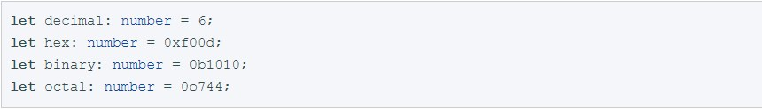

## String
Another fundamental part of creating programs in JavaScript for webpages and servers alike is working with textual data. As in other languages, we use the type string to refer to these textual datatypes. Just like JavaScript, TypeScript also uses double quotes (") or single quotes (') to surround string data.
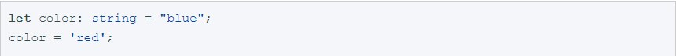

## Array
TypeScript, like JavaScript, allows you to work with arrays of values. Array types can be written in one of two ways. In the first, you use the type of the elements followed by [] to denote an array of that element type:

The second way uses a generic array type, Array<elemType>:

## Tuple
Tuple types allow you to express an array with a fixed number of elements whose types are known, but need not be the same. For example, you may want to represent a value as a pair of a string and a number:
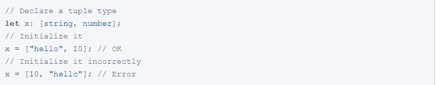

## Enum
A helpful addition to the standard set of datatypes from JavaScript is the enum. As in languages like C#, an enum is a way of giving more friendly names to sets of numeric values.
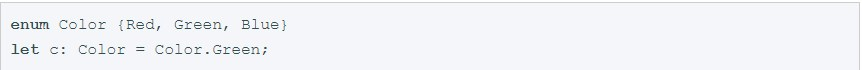

By default, enums begin numbering their members starting at 0. You can change this by manually setting the value of one of its members. For example, we can start the previous example at 1 instead of 0:
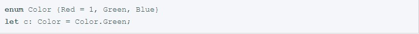

Or, even manually set all the values in the enum:
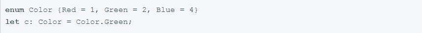

## Any
We may need to describe the type of variables that we do not know when we are writing an application. These values may come from dynamic content, e.g. from the user or a 3rd party library. In these cases, we want to opt-out of type checking and let the values pass through compile-time checks. To do so, we label these with the any type:
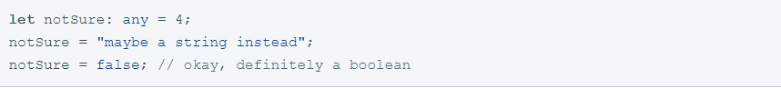
 
## Void
Void is a little like the opposite of any: the absence of having any type at all. You may commonly see this as the return type of functions that do not return a value:
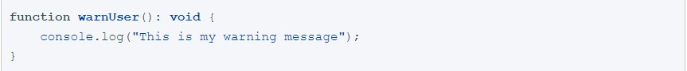
	
## Null and Undefined
In TypeScript, both undefined and null actually have their own types named undefined and null respectively. Much like void, they’re not extremely useful on their own:
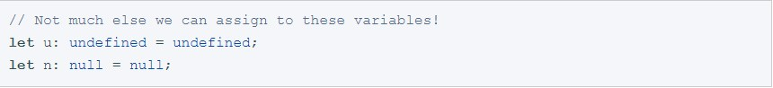

By default null and undefined are subtypes of all other types. That means you can assign null and undefined to something like number.

## Never
The never type represents the type of values that never occur. For instance, never is the return type for a function expression or an arrow function expression that always throws an exception or one that never returns; Variables also acquire the type never when narrowed by any type guards that can never be true.
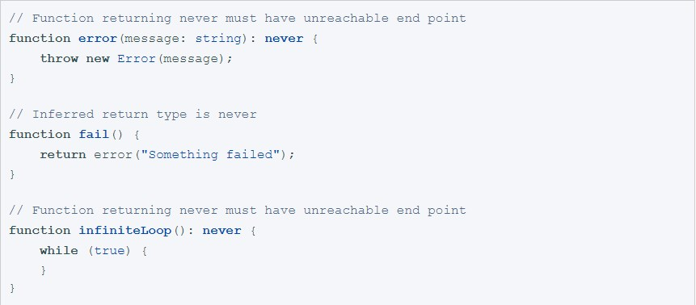

## Type annotations

TypeScript provides static typing through type annotations to enable type checking at compile time. This is optional and can be ignored to use the regular dynamic typing of JavaScript.
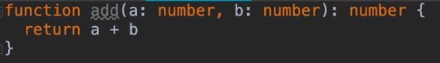

We indicate the type «number» for the parameters «A» and »B» 
And indicate the type of data as «number» that the function should return.

## Generics

The function “REVERSE” can work with different types of data. To do this, we indicate that the function works with the type “T”, takes an array parameter with the type “T”, and returns an array with the type “T”.
The parameter “T” will dynamically adapt to the values that the function takes
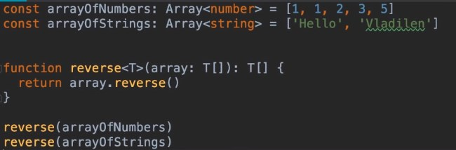
 
## Interfaces
We create a type that is necessary for objects or for classes, where we indicate which fields, functions, elements should be present.
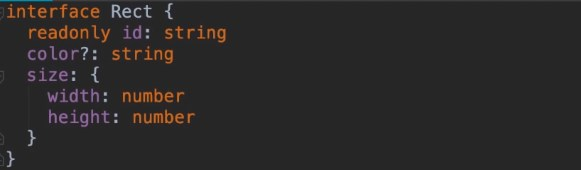
The modifier «READONLY» is set for the field «ID» to explicitly indicate that this field is read-only. Setting the question symbol for the field «COLOR», we say that this parameter is optional.
 
After that we can create a variable «RECT2» and specify a previously created type «RECT»
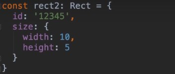

## Classes
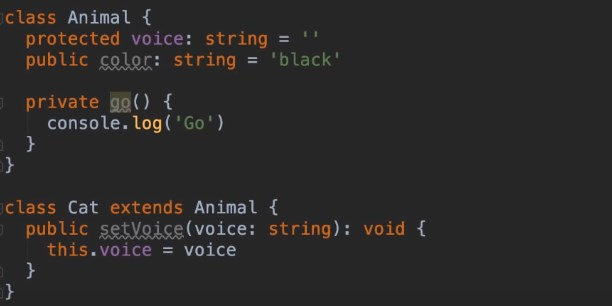

When we specify a modifier «protected» for a field “voice”, this means that this field is available in the class “Animal”, as well as in other classes that inherit from the class “Animal”, for example class “Cat”

Variables or methods with a modifier “private” are available only in the class in which they were defined
Also of note, the use of public on arguments to the constructor is a shorthand that allows us to automatically create properties with that name.

## More information:

https://www.typescriptlang.org/index.html
